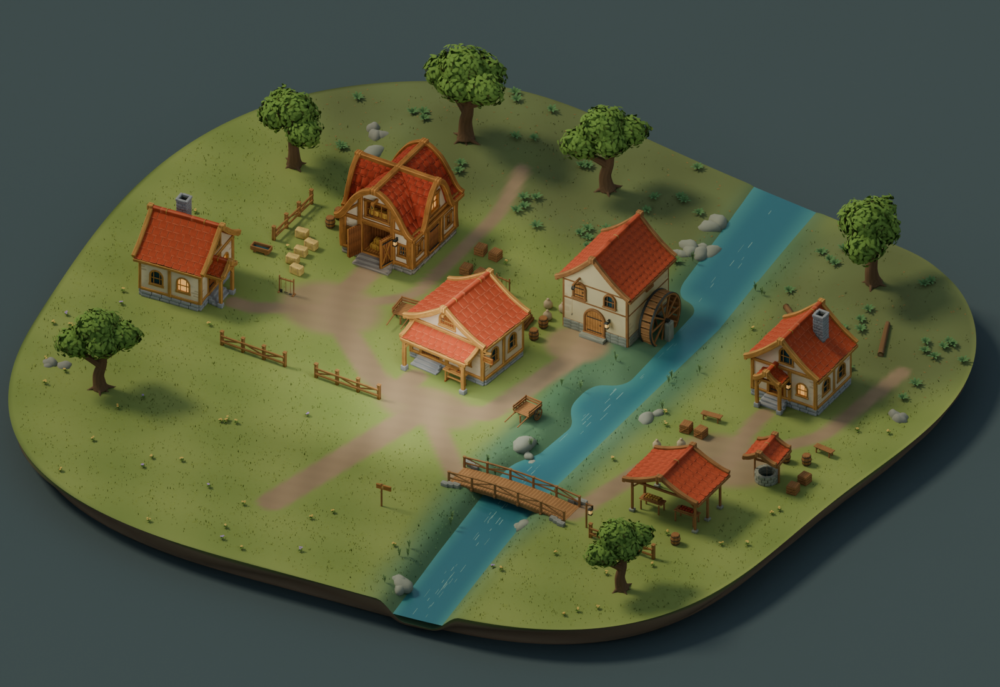

# Worldwright Workflow

**Reference-led, agent-assisted Blender environments—with the visual feedback loop included.**



Worldwright grew out of experiments adapting the world-generation goal of
[Terraingen](https://github.com/alexmeckes/terraingen): turn a written setting into
a coherent small slice of a world. We moved much of the asset creation into
authored Blender/Python construction. Astra interpreted references, wrote and
revised the builders, inspected renders and browser exports, and worked with
Alex Meckes's art direction through repeated corrections.

This repository extracts that **process**, one reusable agent skill, a Codex
plugin wrapper, portable helpers, and a small reproducible example. It does not
require the private Worldwright development repository. It does not implement
an unattended prompt-to-world service. The three case studies document larger
historical builds; their complete scene generators and GLBs are not bundled here.

## Start here

- [The process and how it evolved](docs/process.md)
- [Brookside, Sunwell and Frostpass case studies](docs/case-studies.md)
- [Before/after failure lessons](docs/lessons.md)
- [Runnable kiln-shelter example](docs/quickstart.md)
- [What was actually tested](docs/validation.md)

## Install the plugin

In a current Codex CLI with plugin support:

```sh
codex plugin marketplace add alexmeckes/worldwright-workflow
codex plugin add worldwright-workflow@worldwright
```

Start a new task after installation. Ask:

> Use $worldwright to create a small riverside dye workshop. Start with a new
> design reference, plan its architecture, build one editable exemplar, and
> inspect its exported appearance before extending the scene.

The plugin contains one skill and local scripts. It has no hosted service, MCP
server, required account connector, telemetry, or automatic external publishing.
Building requires a local Blender executable and Python 3.10+. Image generation
uses the host's available image tool when requested; supplied references work
too. A plugin installation alone does not give a web-only host local Blender.

For a repo-scoped skill without plugin support, copy
`plugins/worldwright-workflow/skills/worldwright` into your project's
`.agents/skills/worldwright` directory. Keep its scripts, assets and references
together. The instructions use relative paths and do not depend on this machine.

## Run the example without an agent or an API key

```sh
git clone https://github.com/alexmeckes/worldwright-workflow.git
cd worldwright-workflow
python3 tools/demo.py build --stage finish --render
python3 tools/demo.py check
python3 tools/demo.py serve
```

Open `http://127.0.0.1:8770/`. Drag to orbit, scroll to zoom, or use fixed review
views. The bundled original reference means this rebuild makes no image API calls.
See the [quickstart](docs/quickstart.md) for stages, Blender discovery and a second
build comparison. Output stays in ignored `out/`; the source `.blend` remains
separate from the GLB preview.

## What is reusable

The skill guides decisions and evidence: fresh architectural plans, reference
comparison, structural ownership, restrained asymmetry, separate material passes,
terrain and water interfaces, export review, and explicit acceptance records.
The helpers execute common tasks. The example's layout is deliberately specific;
new architectural types require new layouts and sometimes new builders.

The demonstrated art direction is smooth painted fantasy. The process can be
adapted to other art directions; numeric settings and palettes are examples.
Browser appearance approval does not establish collision, navigation, LODs,
performance, complete interiors or target-engine readiness.

## Contents

```text
.agents/plugins/marketplace.json       Git-installable marketplace
plugins/worldwright-workflow/
  .codex-plugin/plugin.json            Plugin metadata
  skills/worldwright/
    SKILL.md                          Workflow entrypoint
    references/                       Focused production lessons
    assets/                           Brief/review templates + starter
    scripts/                          Blender runner, review and export helpers
docs/                                 Story, illustrated evidence, validation
tools/demo.py                         Convenience entrypoint
tests/                                Packaging and helper regression checks
```

## Contributing and licensing

Useful contributions include a different architectural type exercised through the
workflow, a reproducible export defect, or a before/after that changes a modeling
decision. Include the brief, reference provenance, exact build command, review
views and limitations. See [CONTRIBUTING.md](CONTRIBUTING.md).

Original code, documentation and contributed project media are MIT-licensed to
the extent the contributors hold rights. Generated reference art is identified
in [media provenance](docs/media-provenance.json); no exclusive copyright claim
is made for AI-generated material. Bundled Three.js retains its own MIT notice.
See [LICENSE](LICENSE) and [THIRD_PARTY_NOTICES.md](THIRD_PARTY_NOTICES.md).
Worldwright is an independent project, unaffiliated with OpenAI or Blender.
