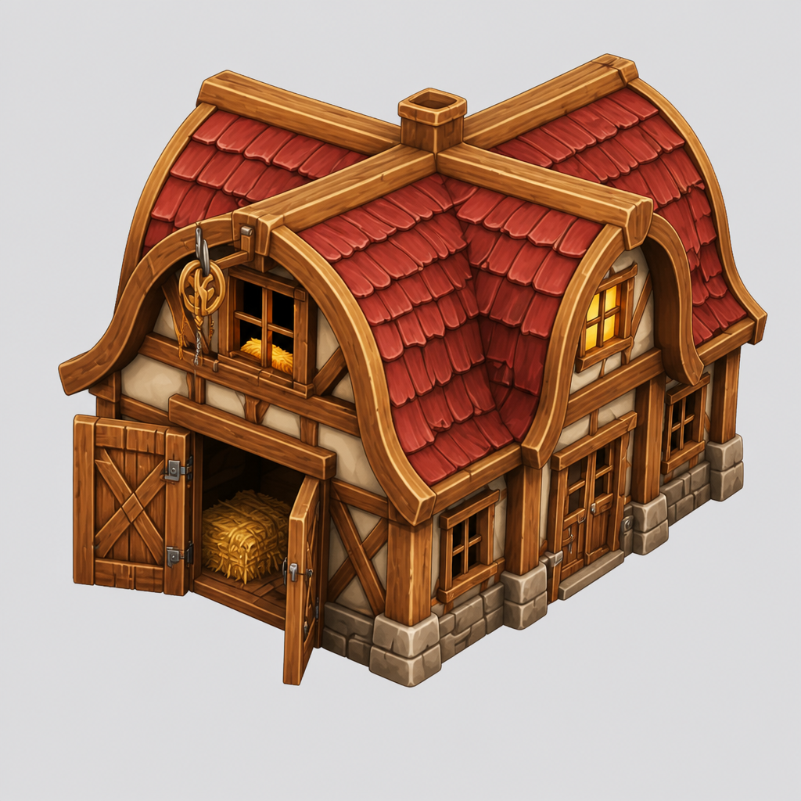
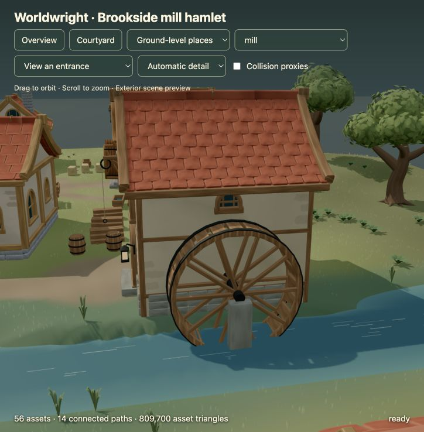
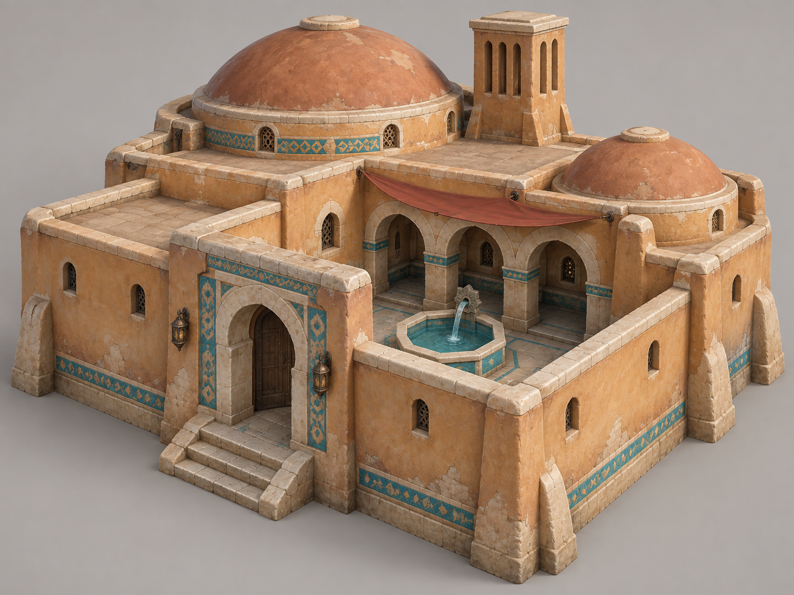
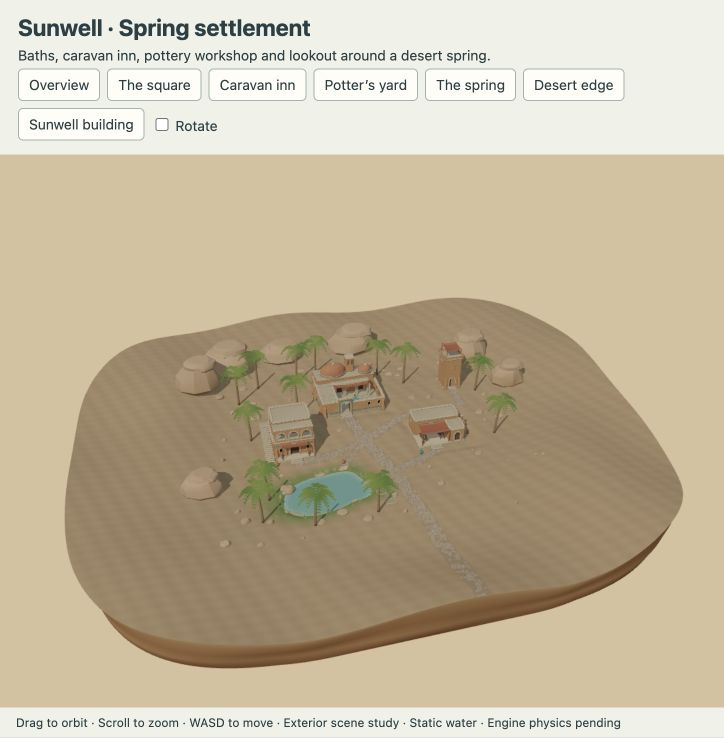
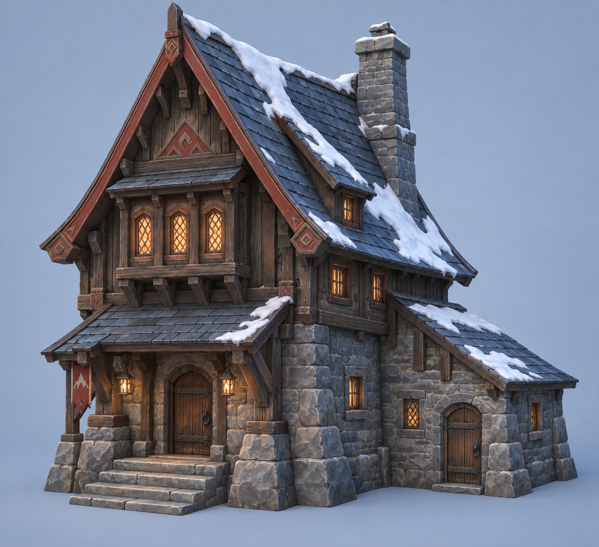
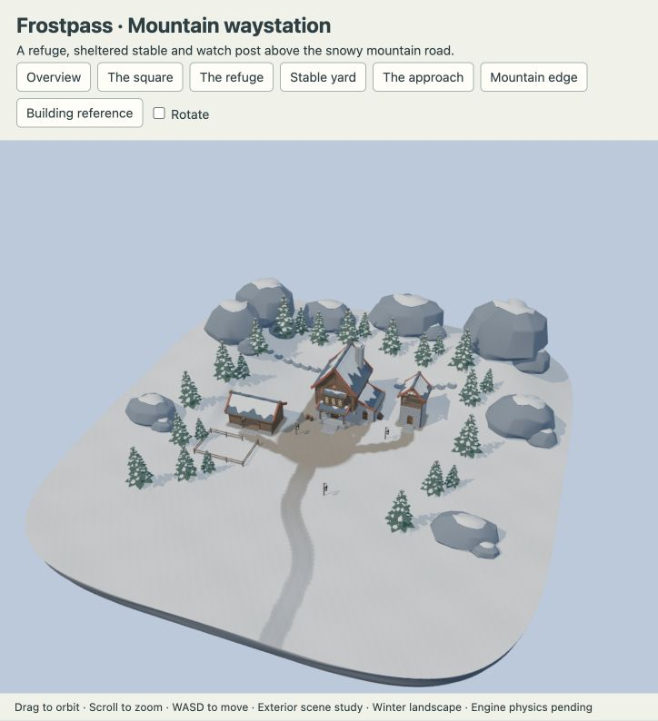
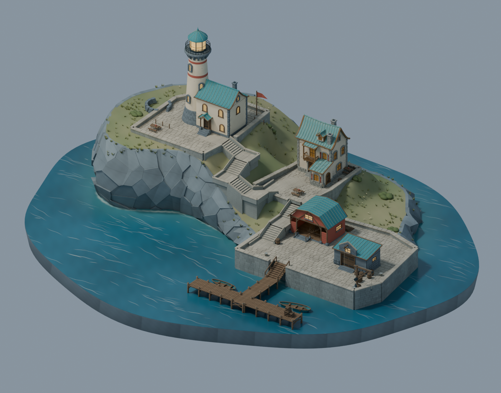
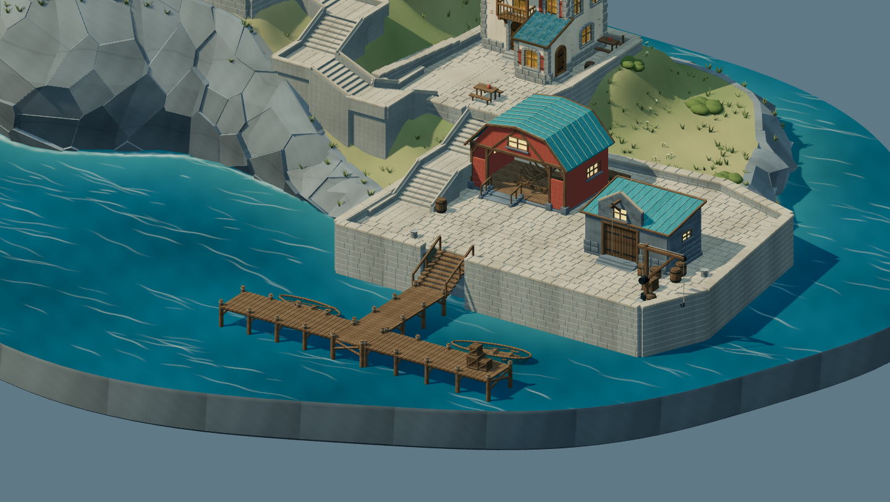

# Environment studies

These are the four scenes selected for the [public gallery](https://placecraft.ameckes.chatgpt.site/). Selection for presentation
is distinct from a universal quality claim or target-engine certification.
Individual historical review records sometimes remained marked as awaiting
feedback; we do not rewrite those records to imply every component was approved.

## Brookside — coherent activity and functional contact

The timber settlement grew from an initial farmhouse/cider-barn reference family.
A second building initially inherited too much cottage structure. The barn only
matched its reference once its own footprint, cross-gable roof and loading-bay
layout were authored. The mill and market later derived from that accepted family;
they did not each have a new generated primary reference.

The scene combined buildings, market props, bridge, routes and vegetation. The
mill was visually near a stream, but the wheel did not meet the water correctly.
The foundation's terrain influence partly refilled the channel. The repair
preserved the channel after terrain blending and checked actual exported bed and
water samples at the wheel.

**Transferable lesson:** model activity and physical relationships, not just
asset placement. Full bounds, support envelope and ground datum differ. User
appearance acceptance followed the mill-water correction; engine integration
remained pending. The small screenshot records that local fix, not every aspect
of the settlement.

## Sunwell — a different architecture, then restrained finish

[Exact reference prompt](references/sunwell-prompt.txt). The new direction used
thick earthen walls, low vaults/domes, courtyard water, ceramic accents and a
windcatcher. It required a fresh architecture instead of timber cottage geometry.

The initial geometry felt primitive. A stronger continuous plaster treatment
helped the joins but went too far: masonry began to look like soft clay. The next
pass preserved firm planes and fitted trim while retaining designed asymmetry.
A separate material pass added sparse painted accents. The user accepted that
restrained building/material direction.

Expansion exposed new issues: roads looked stamped on, then blurred; the spring
was too symmetrical; open paving and water needed export-specific checks. Fitted
stone relief plus appropriate ground-map resolution solved different parts of
road appearance. Unequal banks and shelves made the spring less geometric.

**Transferable lesson:** separate shape, smoothing, paint and surface representation.
A passing building does not automatically yield a convincing environment. See the
[illustrated corrections](lessons.md).

## Frostpass — transfer to an alpine setting

[Exact reference prompt](references/frostpass-prompt.txt). The alpine refuge
introduced a steep slate roof, dark cedar hall on a stone lower story, projecting
window bay, unequal snow cover and a lower service wing. Supporting buildings
extended that architectural language.

Review corrected service-wing roof closure, shared corner masonry and contact
between snow and supporting surfaces. Roads and the finite terrain edge needed
scene-level review. The presentation pass added a closed cool-rock underside and
preserved route contact at the outer edge.

**Transferable lesson:** preserve the decision sequence while redesigning the
forms, materials and ecological relationships. Historical agent checks covered
appearance, contact and regeneration. Complete interiors, measured runtime
performance and engine physics were still outside that acceptance scope.

## Stormglass — design the space between assets

[Explore the harbor](https://placecraft.ameckes.chatgpt.site/scenes/stormglass_harbor).
Building references helped give the inn, boatwright and warehouse distinct
silhouettes. A separate [layout concept](images/stormglass-layout-reference.png)
([prompt](references/stormglass-layout-prompt.txt)) tested their composition. The
build still needed an authored plan for the spaces connecting those buildings.

The rejected stairs were narrow strips. Rebuilding them as short flights with
level turning landings clarified the climb. The final stone flights have eight
risers each, with approximately 18–19 cm rise and 42 cm going; these are study
measurements, not a building-code or universal recipe claim. Continuous masonry
supports meet the bank, and the pier keeps a separate timber stair.

The lower buildings moved apart while keeping their geometry intact. Their full
roof envelopes now have approximately four metres of horizontal clearance. The
quay grew to support separate boat-hauling and warehouse-loading areas, with
related props moved out of those approaches.

Repeated visual checks caught problems a centerline route test missed: a paving
edge covering a tread, a wall projecting into the flight, discontinuous terrain
near a landing, shallow supports left hanging above a lowered bank, and coplanar
paving at an angled junction. The resulting checks sample tread and landing
levels, count surfaces at the troublesome junction, and verify clear approaches.

The user accepted the final appearance ("Looks good"). Five browser views,
export checks and an independent assembly/environment rebuild support this pass;
geometry and textures match, with a small documented UV rounding difference.
[Review and evidence](evidence/stormglass/review.json). This remains an exterior
scene study without engine collision, navigation or performance certification.

**Transferable lesson:** references anchor design; the plan establishes spatial
relationships; visual feedback identifies the failed relationship; exported-mesh
checks help keep the repair from regressing. Preserve accepted assets while
changing the surrounding environment.

## What is distributed

The images and prompts above are curated historical evidence with
[provenance](media-provenance.json). Full historical scene sources and GLBs remain
in the development project. This repository ships a smaller, newly authored
[kiln-shelter example](quickstart.md) that runs without that project.
