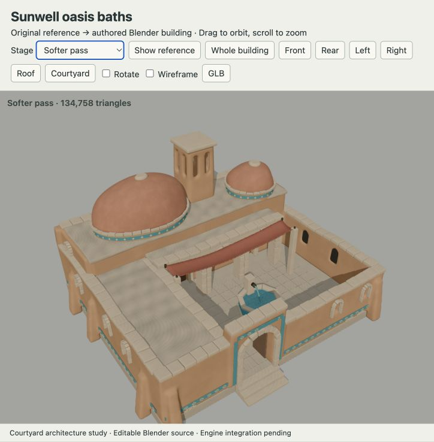
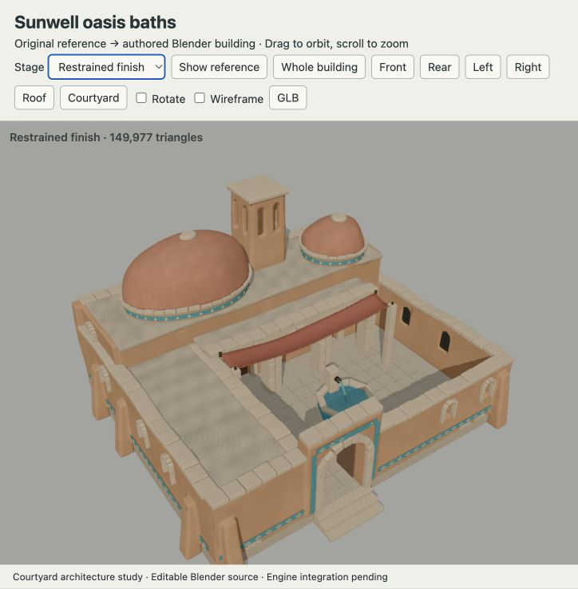
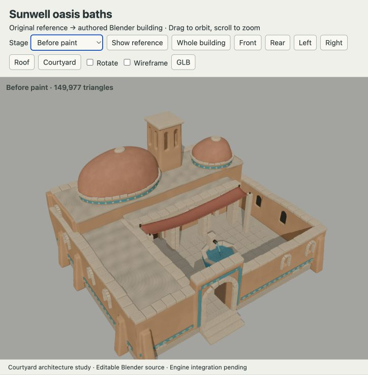
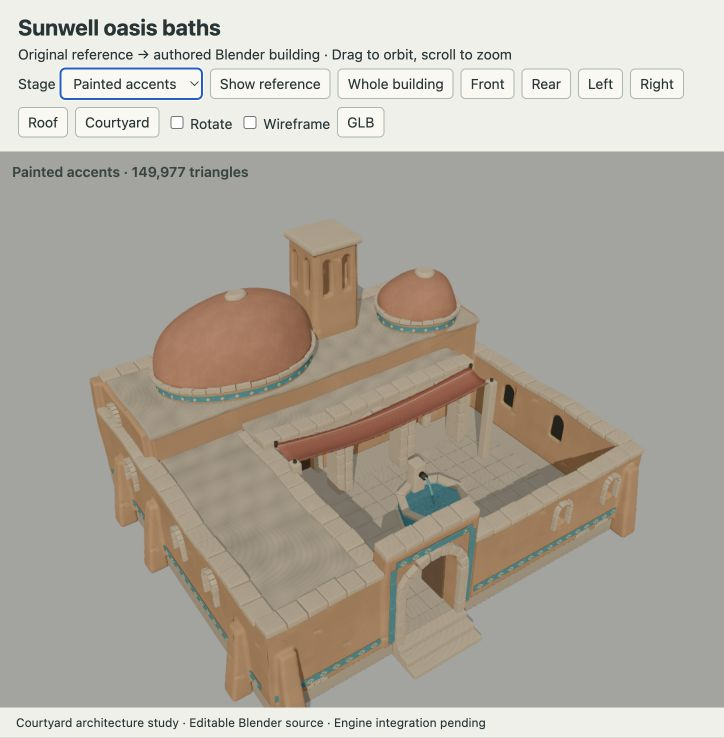
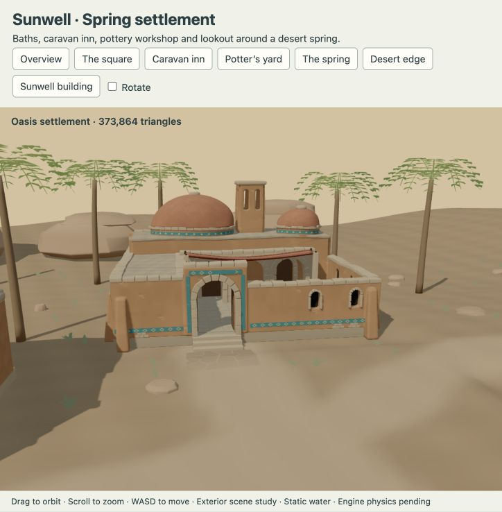
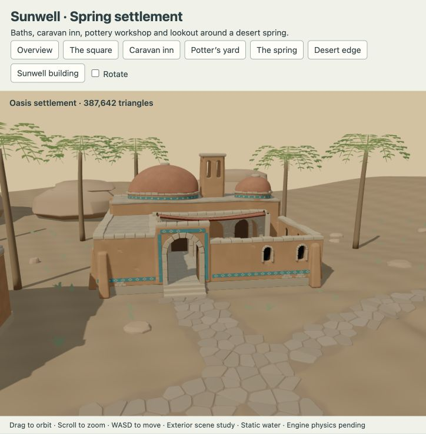
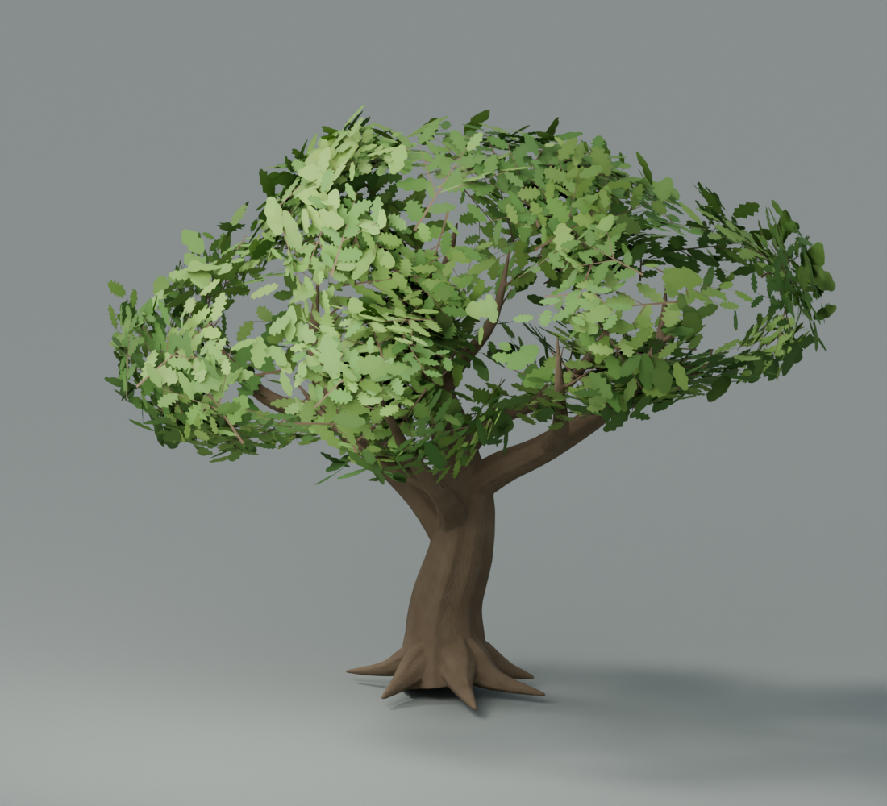
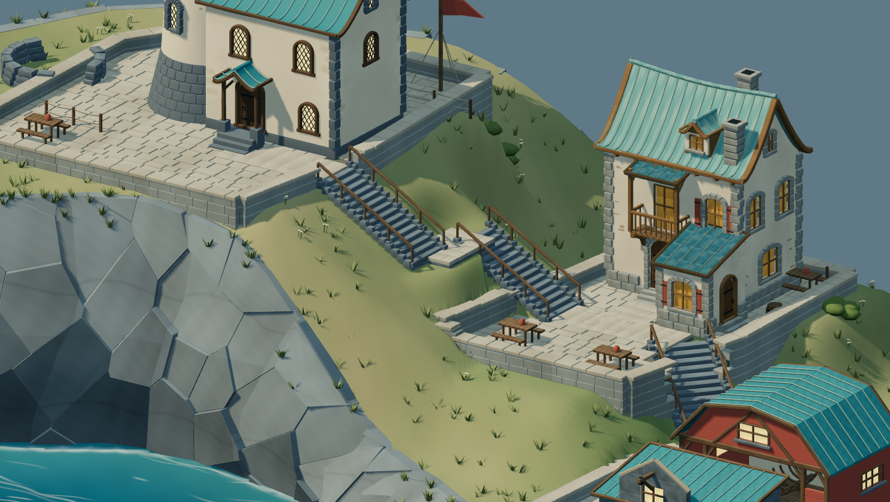
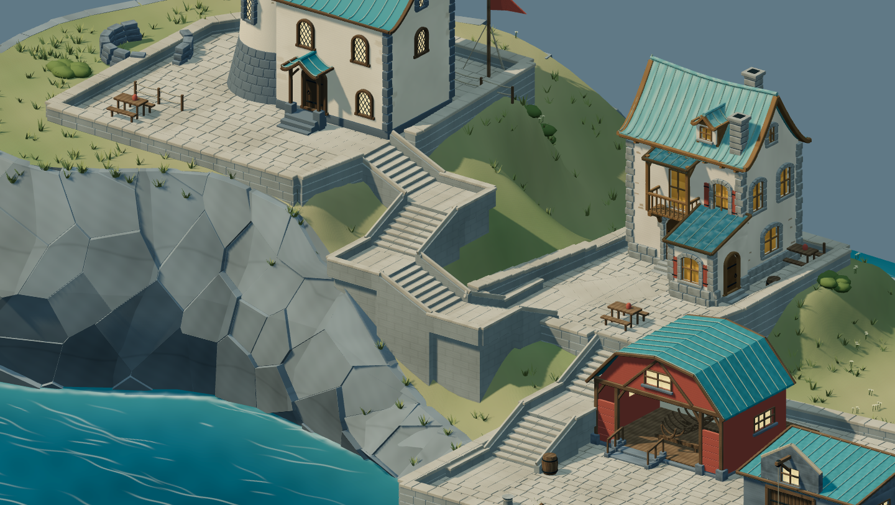

# What changed after visual feedback

The useful artifact is the explanation connecting a visible defect to a changed
construction decision. These images are historical evidence, not new renders.

## Too much blending

| Over-softened Sunwell pass | Restrained geometry pass |
| --- | --- |
|  |  |

The issue was broad rounding that weakened masonry planes. Narrower joins and
less smoothing preserved structure. Dome asymmetry remained a separate control.
**Carry forward:** calibrate designed asymmetry and edge blending independently;
protect fitted trim and mating surfaces. Do not turn the exact Sunwell settings
into universal values.

## A separate paint pass

| Before painted accents | After painted accents |
| --- | --- |
|  |  |

Sparse plaster marks, varied stone treatments and ceramic/cloth accents improved
surface identity after shape selection. **Carry forward:** compare materials at
fixed cameras, keep quiet areas, and verify that a material-only pass preserves
geometry. Correct source shader behavior does not guarantee the same GLB result.

## Roads need the right representation

| Earlier road treatment | Fitted-stone study |
| --- | --- |
|  |  |

Repeated square strips looked stamped onto the ground. Softening the treatment
into earth fields then looked blurry. Slab relief required geometry; fine shoulders
required sufficient material sampling. The export also exposed color-space and
vertex-color interaction problems.

**Carry forward:** prove one threshold, bend, junction and terrain transition
before expanding the network. Repeated rejection calls for reconsidering the
representation, not indefinitely adjusting blur, contrast or noise. This does
not mean every setting should use stone paving.

## Density does not rescue foliage structure

Earlier trees had excessive leaf density, then obvious disconnected foliage.
The questions were canopy organization and branch/module connectivity, not simply
how many leaf objects to scatter. Grass also looked splotchy because color,
falloff, normals and shadows interact.

**Carry forward:** review a bare structural tree and the finished crown, judge
leaf clusters at the target distance, and optimize the expensive component.
The oak remains a provisional study; this package makes no production-tree claim.

## Good buildings still need a designed environment

| Earlier stairs and crowded quay | Refined circulation |
| --- | --- |
|  |  |

Stormglass's buildings improved through individual references, but the surrounding
space remained weak. Short stair flights, broad turning landings and a working
quay made the relationships legible. Moving the workshop and warehouse apart by
their full roof envelopes created separate hauling and loading areas.

The fixes exposed other defects: paving edges intruded on steps, terrain formed
vertical green ridges, and an angled path overlapped its landing. These required
polygon clipping, continuous grading and a single owner for each surface.

**Carry forward:** design circulation and working space before dressing. Use the
same route plan for geometry and exclusions. Inspect each fix in the actual
viewer, then turn its concrete failure into a check. More detail or another
reference cannot supply missing spatial relationships. See the
[Stormglass study](case-studies.md#stormglass--design-the-space-between-assets).

## Other durable lessons

- A fresh building type needs its own plan. Shared materials do not establish
  architectural identity; a barn is more than a cottage with bigger doors.
- Corners, posts and roof junctions need one owner. Random facade generation
  produced doubled pillars and mismatched beams.
- Plan unseen elevations. Logical windows follow room use and structure.
- Actual mesh contact matters. A mill beside a river is not proof its wheel meets
  water. Check the interface after terrain blending and export.
- Finish the ground as part of the composition. A finite diorama needs a deliberate
  silhouette and underside; preserve the route where it leaves the edge.
- A failed numerical test must remain a failure. A nice render and a triangle
  budget do not prove physics, navigation or performance.
