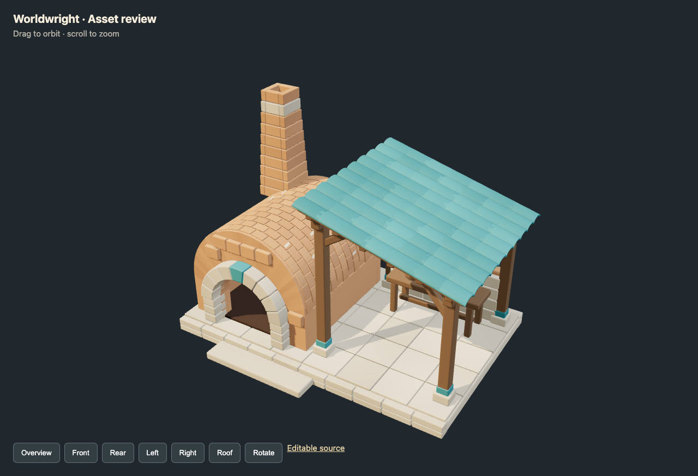
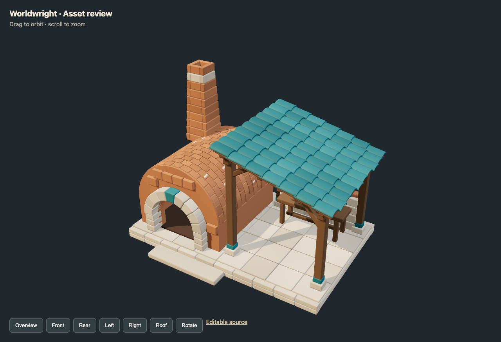
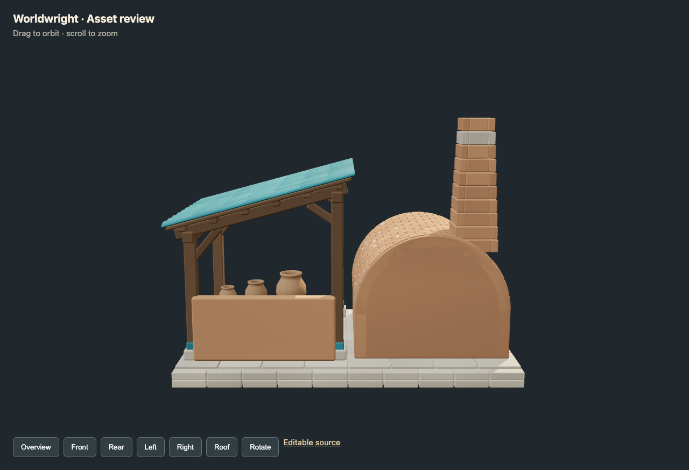
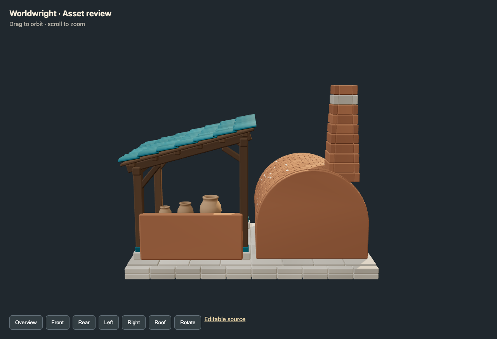
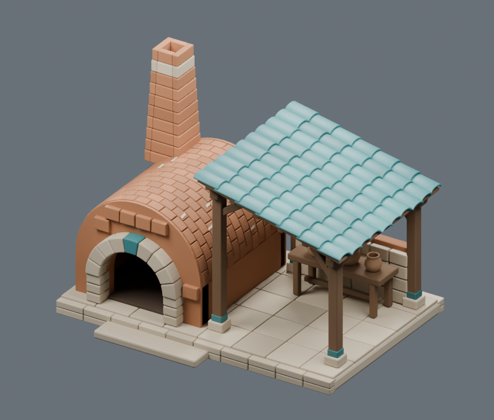

# Validation of the first public package

The fresh exercise built a potter's kiln shelter from a newly generated reference,
using the extracted workflow and new self-contained code. This is an authoring-agent
exercise, not an independent-agent benchmark. It tests a bounded tutorial asset;
it does not establish arbitrary scene generation or historical hero-asset quality.

## Visual feedback changed the result

| First exported overview | Refined exported overview |
| --- | --- |
|  |  |

The first pass had regular bright tiles and overlapping tile surfaces. Distinct
lapping courses, bounded toe variation and a calmer palette improved readability.
A consistent base tint removed radial color bands from the front wall.

| First exported rear | Refined exported rear |
| --- | --- |
|  |  |

The rear view exposed a coplanar closure/vault overlap. Giving the rear cap a
separate termination plane removed the dark ring. The actual browser also made
the roof overlap problem easier to see than a single studio overview.

The source renderer and browser use different lighting. We inspect both, without
claiming identical rendering. The final starter remains simpler and more regular
than its reference, particularly at the rear and in painted surface detail.

## Completed checks

- Blender 5.1.1 on macOS: massing, construction and finish commands executed.
- Six Blender review renders and six actual Chrome/WebGL views captured.
- Model loading, browser console/errors and rotation control checked.
- Export contains 81,632 triangles and seven material primitives; source retains
  527 editable objects. This is a source-quality tutorial preview, not an optimized
  game-scatter asset. No measured FPS claim is made.
- Thirteen rays against the reimported GLB check entry clearance, a chamber
  backstop, working approach, bench supports and both sides of pot/table contact.
- Skill Creator and Plugin Creator validators passed. Their validation dependency
  was isolated locally; the shipped runtime helpers use Python's standard library
  and Blender's bundled modules.
- Regression tests exercise valid/interleaved GLBs, corrupt indices, nonfinite
  values, invalid normals, buffer overruns, unsupported inputs, changed transforms
  and payloads. Packaging checks verify relative links and media hashes.

The initial pot support probe started inside the table and produced a false
negative. The corrected contract casts opposing material-filtered rays across
the actual interface. That was a test-definition repair, not a geometry repair.

## Clean-checkout regeneration

Cloned the committed package into a separate directory, rebuilt with system
Python and Blender using only the cloned files, and compared it with the reviewed
export. The GLB was byte-identical, including the embedded geometry and colors.
The render-enabled and render-disabled builds also produced identical GLBs.
See the [clean rebuild report](evidence/kiln-shelter/clean-rebuild.json). This proves
reproduction of this recipe on the tested machine, not cross-version equivalence
or independent-agent ability to design arbitrary assets.

## Installed-plugin check

Installed `worldwright-workflow@worldwright` through the Codex plugin CLI, then
ran the starter from the installed plugin cache with no repository wrapper. Its
GLB was also byte-identical to the reviewed export. See the
[installed-plugin build report](evidence/kiln-shelter/installed-plugin-build.json).
This verifies local package discovery and helper self-containment.

## Evidence and limits

- [Source/export metadata](evidence/kiln-shelter/manifest.json)
- [Actual exported contact results](evidence/kiln-shelter/export-contacts.json)
- [Browser loading/control record](evidence/kiln-shelter/browser-check.json)
- [Agent review and corrections](evidence/kiln-shelter/review.json)
- Final browser [front](evidence/kiln-shelter/front.png),
  [left](evidence/kiln-shelter/left.png), [right](evidence/kiln-shelter/right.png),
  [roof](evidence/kiln-shelter/roof.png).

User appearance approval is not claimed for this new starter. Engine readiness
remains false: no collision/LOD/navigation integration or populated-world
performance validation was performed. Other Blender versions/platforms have not
yet been verified. Historical showcase scenes are illustrated case studies, not
bundled reproducible scene exports.
