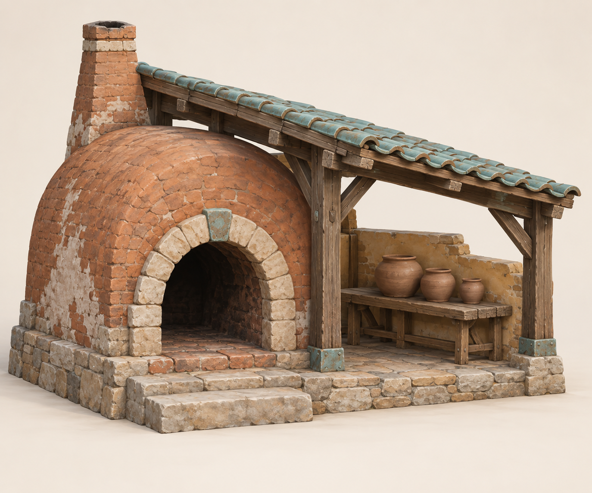

# Kiln shelter — fresh packaging exercise

## Intent and reference

A small exterior potter's work shelter with a kiln, tiled canopy and workbench.
Smooth painted fantasy; meters, intended overview and 5–10m inspection distance.
This is an architectural game-art study, not a buildable working-kiln design.

The original image was generated for this package using the exact saved
[prompt](prompt.txt). Observed features: heavy arched mouth; left kiln mass;
rear-left tapered chimney; right open shelter with turquoise curved tiles;
stout cedar framing; low screen wall; bench and three graduated pots; low stone
foundation and broad approach.

Reference critique: the requested barrel vault reads somewhat dome-like in the
image. Its small block wear is richer than the bounded example. Hidden support
and roof contact cannot be verified from one view. The builder chooses an explicit
barrel section and a rear closure. It preserves the reference's unequal massing
and functional relationships while simplifying surface detail. This is not a
pixel-faithful reconstruction or an independent-agent quality benchmark.

## Plan

- Source X points right, front is -Y, Z points up. Ground datum z=0.
- Foundation 5.8m wide × 3.6m deep; floor surface approximately z=.31m.
- Left kiln axis x=-1.43; front y=-1.44, rear y=1.35; vault radius 1.32m,
  spring height 1.12m. Smaller arched mouth has radius .67m and spring .87m.
- Rear closure is solid masonry. No hidden rear doors/windows are implied.
- Chimney at x=-2.16, y=.83. Its hollow stack intersects the vault and stays
  clear of the timber roof; it is not a modeled thermal/flue system.
- Shelter roof slopes down to the right. Four posts at x=.18/2.63 and
  y=-1.30/1.30 are single-owned by the shelter plan. Knee braces support the
  sloping ties; rafters support the roof underlay.
- Back screen gives the bench a boundary; the front/right remain open.
- Bench sits behind the approach; pots have real open lips and seat on its top.
- Approach goes to the firing mouth and working bay. No complete house interior,
  simulation, collision, LODs or gameplay behavior is included.

## Checkpoints and review criteria

Massing: unequal kiln/shelter silhouette and useful access without dressing.
Construction: genuine chamber opening, connected shell, four owned posts,
continuous roof, bench/pot support, all elevations including rear.
Finish: restrained ceramic variation and warm masonry, narrow softened edges,
quiet broad surfaces and a little bounded tile-edge irregularity.

Review overview, front, rear, both sides and roof in Blender and the actual GLB
viewer. Check contact rays after GLB import. Preserve pass 1 and pass 2 separately.
The example remains a tutorial asset: simpler and more regular than the reference,
with a fixed architectural layout and no claim of historical hero-asset quality.
